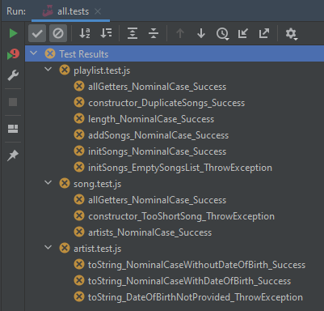

# README

# RIA1_EVAL_PLAYLIST

RIA1 EVAL PLAYLIST est un projet permettant d'évaluer les compétences des technicien-ne-s JavaScript.

## Evaluation

Les compétences évaluées sont les suivantes:

* Dessiner un diagramme de classe en partant d'un code existant.
* Coder en partant des tests.
* Appliquer les bonnes pratiques OOP.

## Installation du projet

Pré-requis :

* npm 6.14.13 ou ultérieure
* node v14.17.3 ou ultérieure
* git version 2.34.1.windows 1 ou ultérieure

Note : configuration testée et validée sur l'IDE WebStorm : version 2021.3.1

Après avoir récupéré le référentiel:

```
    npm install
```

## Usage

Pour tester tout le projet :

```
    npm run test
```

Le résultat a obtenir en début de projet :

  

Pour tester une seule classe :

```
    npm run test [className.test.js]
```

## Prise en main du projet

Une fois le code récupéré, il s'agit de le *forker* sur un référentiel vous appartenant. Puis de traiter les classes de tests disponibles.

## Aides

Voici des sources qui vous aideront à vous lancer :

* [Les classes en Java Script](https://developer.mozilla.org/en-US/docs/Learn/JavaScript/Objects/Classes_in_JavaScript)
  * [Les accesseurs en Java Script](https://developer.mozilla.org/fr/docs/Web/JavaScript/Reference/Functions/get)
  * [Les mutateurs en Java Script](https://developer.mozilla.org/fr/docs/Web/JavaScript/Reference/Functions/set)
  * [Exception en Java Script](https://rollbar.com/guides/javascript/how-to-throw-exceptions-in-javascript/#)
  * [Les dates en Java Script](https://www.w3schools.com/jsref/jsref_obj_date.asp)
* [Premier pas avec Jest](https://jestjs.io/docs/getting-started)
  * [Les comparateurs](https://jestjs.io/fr/docs/expect)
  * [Les exceptions](https://jestjs.io/docs/using-matchers#exceptions)
* [Convention de nommage en Java Script](https://developer.mozilla.org/fr/docs/MDN/Guidelines/Code_guidelines/JavaScript)

## Contributing
Lors de la lecture en commun des tests, vos retours sont les bienvenus. 

## Livraision
* Un zip respectant les critères suivants:
  * Nommage = RIA1_EVAL01_[IntranetFirstFamilyName].zip
  * Livré dans teams, via un message privé au scrum master (qui vous quittancera la bonne réception).
  * Les fichiers en lien avec git. permettant de voir la bonne utilisation du versioning.
* La branche qui sera prise en compte pour l'évaluation est la "develop"

## License
Cet examen est la propriété du CPNV et de son auteur.

## Source 
[Make a readme](https://www.makeareadme.com/)